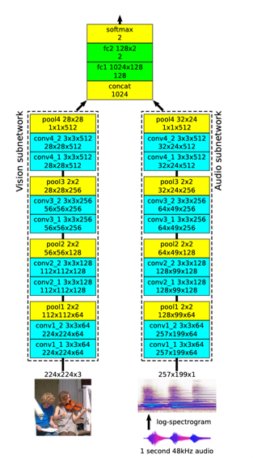
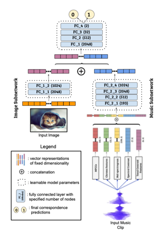
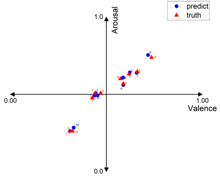
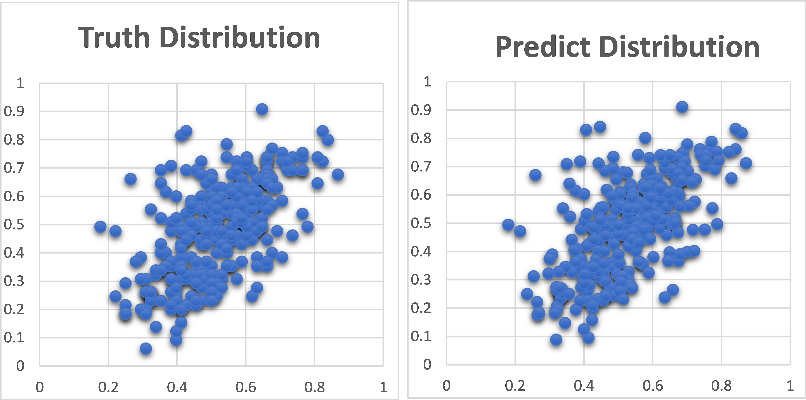
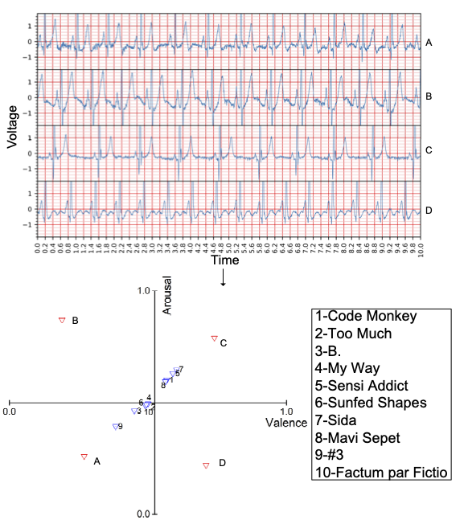

# Detail Result

## Comparison with baseline
Since there is few researches about calculating the similarity between ECG and music, we choose the baselines from matching image and music task. $L^3\ Net$ [1] and $ACPNet$ [2] extract features for image and music, fuse the extracted features and pass through several FC layers to classify whether music and image are similarity. We replace the image subnetwork of them with ECG subnetwork and replace the cross-entropy loss with MSE loss. 
The following two figures are the structures of two model. The dataset of each model is different.  $L^3Net$ uses log-spectrograms as input to ECG branch in origin.  We train each model on our own dataset.

the Similarity MSEs of each model is shown in the following table.

|     | Similarity  MSE |
|  ----  | ----  |
|  $L^3-Net$ | 0.0243 |
|  $ACP-Net$  | 0.0287 |
| CardioMusic | 0.0086|

## Music Inference

We predict ten music clips from test set using the music branch. The ground truth and predict label are plotted in the following figure.

we can see that the music brance of CardioMusic is effective.

The true VA distribution of whole music-test and predicted VA distribution of whole music-test is shown bellow.

We can conclude that the music predict is pretty good.

## Ablation Experiment

the results of  modified CardioMusic are shown in the table.

|     | Similarity  MSE | ECG VA MSE | Music VA MSE|
|  ----  |----|  ----  | ----  |
|  CardioMusic| 0.0086 | 0.0113| 0.0002 |
| CardioMusic w/o VA  | 0.0287 | --| --|
| CardioMusic w/o S| 0.0101|0.0121 |0.00005 |

The CardioMusic w/o S gets the better Music VA MSE (5*10^-5) and close ECG VA MSE (0.0121) to CardioMusic, while the CardioMusic gets the best similarity MSE (0.0086) even better than calculated by VA predictors from CardioMusic w/o S (0.0101).
## The Similarities of four ECG records and ten music clips. 

The Similarities of four ECG records and ten music clips are shown below, and the samples of ECG records and music clips can be find in [this direction](./samples). If the similarity is more than 0.5, then we can say the ECG and music are similar.

The ground truth label of the four ECG signals are (0.25, 0.25), (0.25,0.75), (0.75,0.75),(0.75, 0.25).

From this table, we can find that the ECG A is similar to music clip 9, ECG B and D is similar to nothing, and ECG C is most similar to music clip 7. 

We can conclude that the ECGs with low emotion VA are tend to be recommend the music with similar emotion which is gentle and sad, while the ECGs with high emotion VA are prefer the passionate and happy music. 

# Reference
[1] Relja Arandjelovic and Andrew Zisserman. 2017. Look, listen and learn. In IEEE International Conference on Computer Vision. 609–617.

[2] Gaurav Verma, Eeshan Gunesh Dhekane, and Tanaya Guha. 2019. Learning affective correspondence between music and image. In IEEE International Conference on Acoustics, Speech and Signal Processing. 3975–3979.